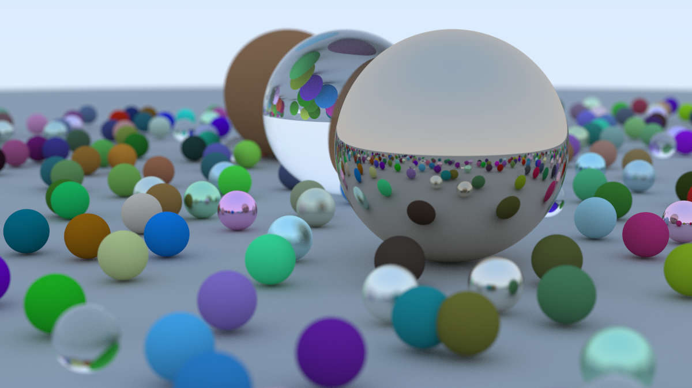

# RayTracer book1 report

## 项目结构：

* main.rs :  初始化场景的信息，镜头的参数设置，渲染图片的采样信息，保存路径等信息

* camera.rs : 实现了对像素的多采样抗锯齿化，渲染，并且在渲染过程中进行虚焦模糊(defocus)，对反射和折射光光进行追踪

* hitabel.rs : 实现了球面的抽象类，进一步继承产生记录所有渲染物体的类，支持对光线交点的判断；实现了 HitRecord 类用来记录光线交点的信息

* color.rs : 在仓库提供的基础上增加了Gamma空间和线性空间的变换

* interval.rs : 用来记录区间间隔实现的类，简化代码编写

* material.rs : 实现了三种主要的材质：Lambertian, Metal, Dielectric ； 使用了 Lambertian Reflection, Mirrored Light Reflection, Fuzzy Reflection, Snell's Law, Total Internal Reflection, Schlick Approximation 等渲染光线的方法

* ray.rs : 使用了仓库提供的模板，创建了一个描述光线的类

* utils.rs : 主要包含了随机数，随机向量的生成，折射反射光线的计算等函数，在仓库提供的文件基础上，增加了几个新的随机向量的生成函数。

* vec3.rs : 使用了仓库提供的模板，三维向量类实现了加减，点乘，叉乘，标量乘除运算

## 效果展示：

