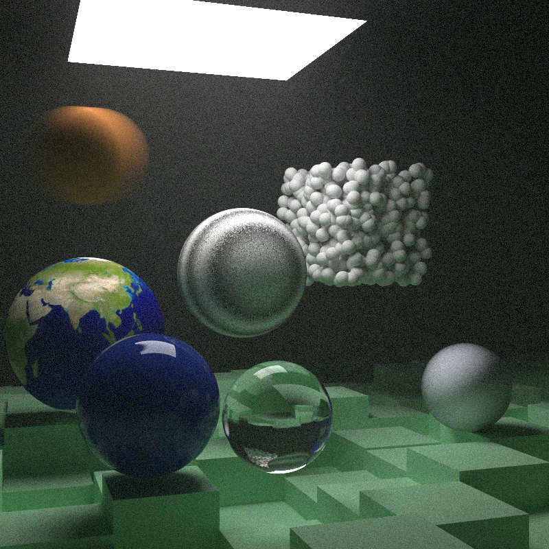

# RayTracer book2 report

## 项目结构：

在book1的基础上增加了一些新的东西

* main.rs :  在原先的基础上对于每一个场景设置了一个对应的函数来记录渲染的参数

* camera.rs : 在原先的基础上使用了多线程优化，可以设定切分的大小和线程数

* hitabel.rs : 在原先的基础上增加了一些继承了 Hittable 的抽象类: Translate, RotateY, ConstantMedium 用来控制物体的转向和volume的渲染

* color.rs : 没做什么改动

* interval.rs : 在原先的基础上增加了和 f64, Interval之间的加法运算，以及取并集和交集的函数

* material.rs : 在原先三种材质：Lambertian, Metal, Dielectric的基础上，扩展了MaterialTrait的方法，增加了一个 emitted 函数，用来派生得到 DiffuseLight 材质模拟光源；同时也增加了一个 Isotropic 材质

* ray.rs : 没做什么改动

* utils.rs : 增加了一个f64类型随机数的生成函数，其余没做什么改动

* vec3.rs : 没做什么改动

* bch.rs : 实现了一个KDTree, 可以快速计算光线撞到的物体，加快渲染速度，按照book2的内容实现了bvh的优化

* aabb.rs : 实现了一个 boundingbox 用来将渲染的物体框成一个平行六面体来实现划分，同时定义了aabb的若干初始化方式和也vec3, aabb之间的加法运算

* perlin.rs : 定义了一个perlin noise的类，用来优化纯色的材质，并且按照book2实现了线性插值和turbulance的优化

* quad.rs : 从 Hittable trait继承得到的类，用来渲染平行四边形的物体

* sphere.rs : 从 Hittable trait继承得到的类，用来渲染球体

* texture.rs : 实现了一个 TextureTrait 的方法，然后继承得到了若干种材质: Solidcolor, CheckerTexture, ImageTexture, NoiseTexture分别实现了对纯色，棋盘格，图片和噪声材质的渲染

## 效果展示：

width = 800, samples_per_pixel = 1000, max_depth = 40

