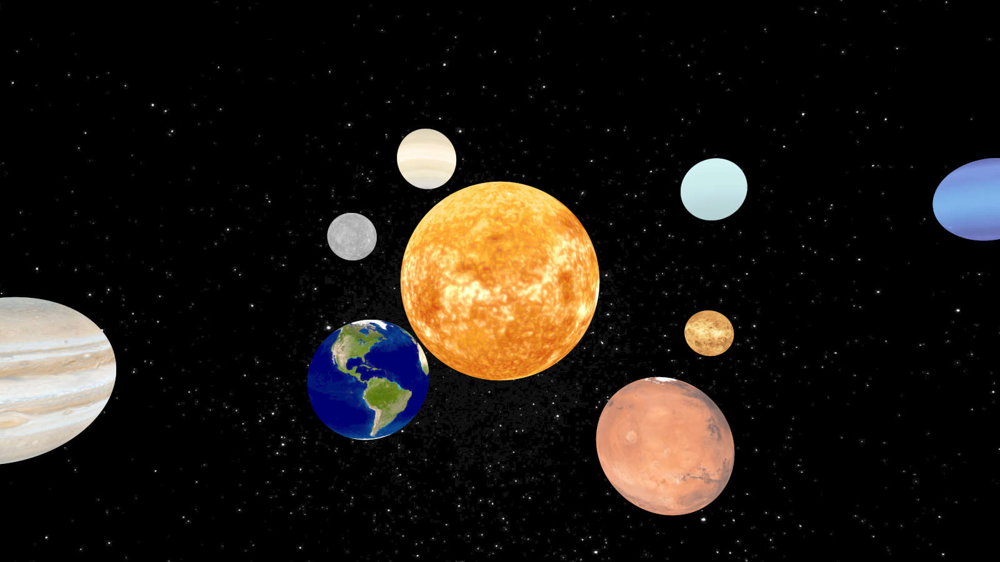

## RayTracer final report

### 推进 book3

 完成了 MonteCarlo 方法对渲染过程中随机采样的优化，在 `render` 过程中采取了分层采样的方式

 在渲染的过程中引入概率密度函数 (PDF) ，优化了 `Lambertian` 的散射 PDF 计算

 增加了在半球面上采样的采样方式

 

 ### 一些渲染尝试

 1. 找了一些太阳系行星的贴图来渲染一个太阳系的照片，但是如果想模拟真实的照片，因为真实距离间隔太大，只有太阳在发光但光强又无法准确模拟，行星带阻隔，轨道平面不同等原因，实际渲染出来的照片很难看清每一颗行星。所以为了美观起见，就只能做了一些调整，让每一颗星球在本身贴图的材质上也带上 `DiffuseLight` 的材质，本身也像恒星一样能发光,背景也是在本身太空的贴图上增添了一些发光的星星点缀

 1. 随机生成了一些发光小球，底面选择了玻璃材质的表面，想模拟水灯的效果

